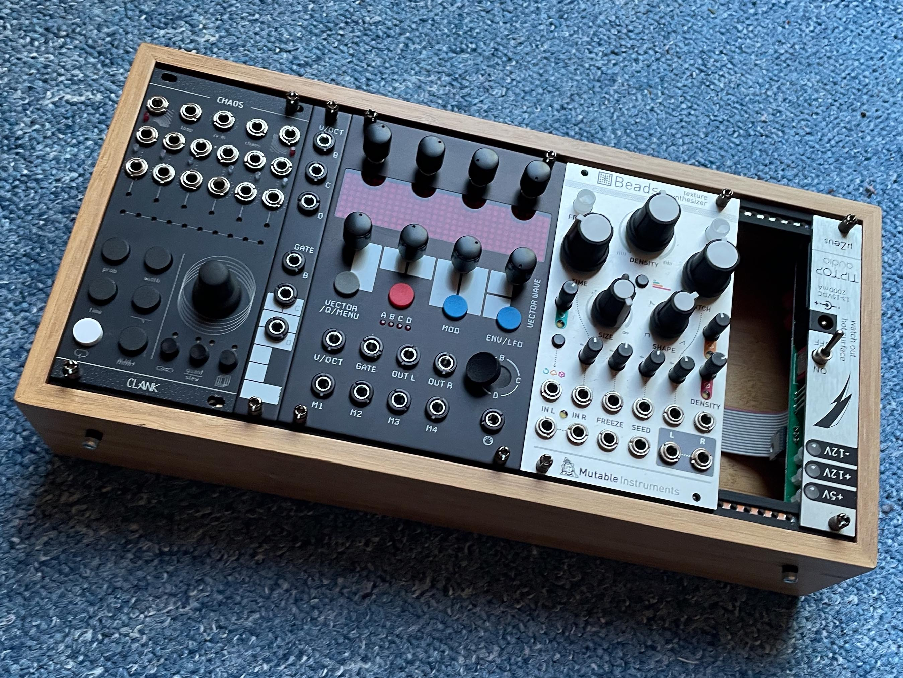
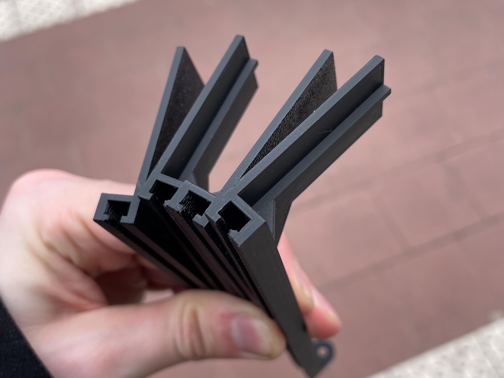
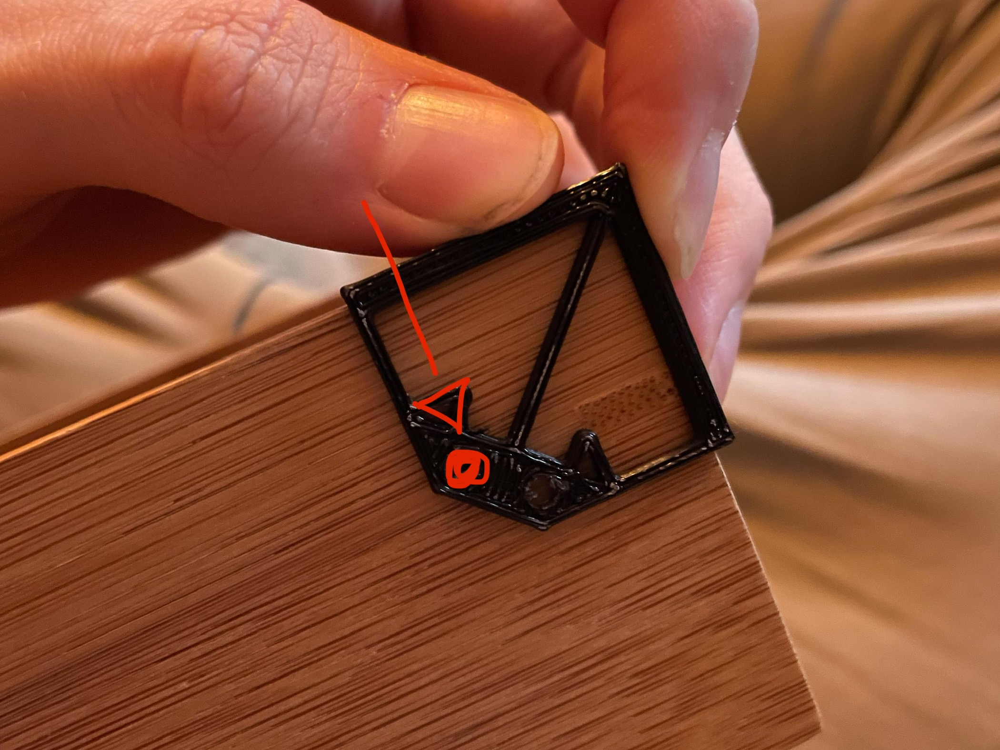
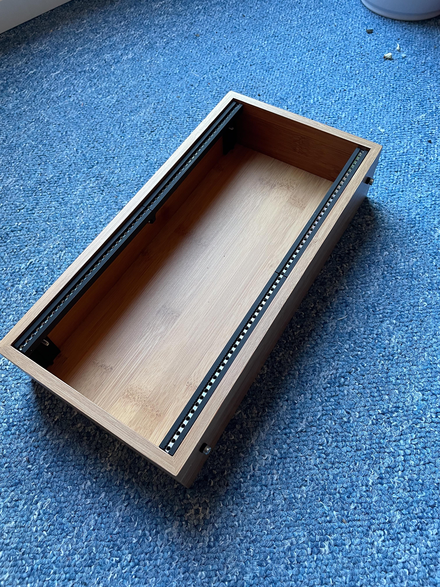
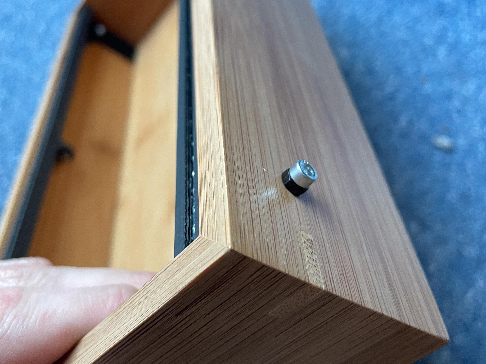

# IKEA Tavelan Eurorack Cases

Making Eurorack Cases based on the IKEA Tavelan Boxes and some 3D printing.
Since I'm lazy and unfocused, this will slowly get updated to it's full glory. 
This is also my first time using GitHub, so don't look behind the curtains xD

**This guide is incomplete!**
The 22HP Case isn't done yet, but you can start with the 56HP one ;)

If you're having any problems / difficulties, please let me know:
[Instagram](http://instagram.com/finnglink/) // [Discord](http://discordapp.com/users/finnglink)

# What You'll Need

- a set of [IKEA Tavelan](https://www.ikea.com/de/de/p/tavelan-tablett-50465756/) boxes (7.99)
  The big case is ~56HP, the small one ~22HP, both are about 50mm deep.
- 4x the [main rails](230425_FG_IkeaCase_Rail.stl). **Important:** Print 2x as is and the other 2x mirrored, or they won't fit together!
- 1x the [drill guide](230502_FG_IkeaCase_DrillGuide.stl). You only need to print this once, it works in multiple orientations.
- 2x 84HP [threaded strips](https://www.ebay.de/itm/175229118150?hash=item28cc7826c6:g:kHEAAOSwPKpgBDY3). That will be just enough for both cases, you'll need to cut them yourself. 
  You COULD go with sliding nuts, but you'll loose a bit of stability.
- 6 M3 nuts (I've used 4 additional ones on the outside for decoration)
- 6x M3x20 bolts (I'm using hex socket head cap ones, but that's down to your preferred style)
- 2x M3x10 bolts (or whatever, these are to connect the rails internally, 10mm is about the minimum you need. If you're buying just for this project, use 20mm instead)
  You might also get away with 15mm ones, I'll need to check that. 
- some M3 washers (I'm using plastic ones)

- (access to / someone with a) 3D printer
- 3mm drill
- the right driver for your screws + something to hold the nuts while tightening
- a metal saw / dremel for the rails

# How To (56HP)

1. Print the [main rails](230425_FG_IkeaCase_Rail.stl) four times. **Important:** Print 2x as is and the other 2x mirrored, or they won't fit together!

2. Cut your threaded strips to length (284,5mm), be careful, you're cutting metal!
3. Sand the edges
4. Assemble your rails (screw both 3D printed halves together and insert the strip) x2. 
5. Print and use the drill guide to drill four holes into the case with a 3mm drill. Position the template on the outer, upper edges of the case, with the protrusion tightly on the wood. Always use the hole with the arrow pointing DOWN from the open side. Look at the following image for reference.

6. Place the assembled rails in the case, making sure the supports are tightly against the bottom, and (using the holes you've just created) drill through the plastic.
7. Add some washers between the case and the 3D printed rails and screw everything together. Don't tighten the screws too much to prevent cracking the plastic!
8. Add your modules and you're done ;)

**Important:**
You might need to add more or less washers, depending on your particular case. They might have some warping.

# The End
I hope this was a fun project and you got through with ease. If you're having difficulties at any point, please let me know.
I'd also love to see your creations! Tag me on Instagram or send me a photo to add here.
